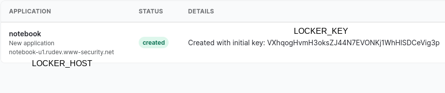
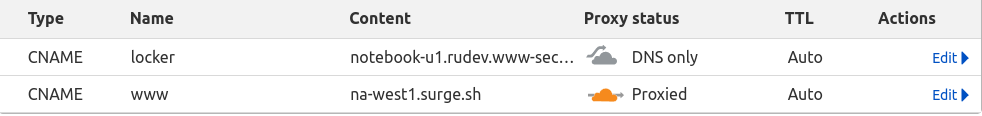

# locker-example-notebook

Simple example notebook application to show how easy to write secure multi-user web application with locker.

## Quickstart (Stage 1): Development/testing on localhost

This is short guide to create and deploy your first locker application on localhost and then deploy it on free CDN. 

### Clone this repository
`git clone https://github.com/yaroslaff/locker-example-notebook.git` and `cd locker-example-notebook`.

### Create app on locker server 
Create application in [myapps](https://myapps.www-security.com):

### Create .env file
~~~shell
LOCKER_HOST=notebook-u1.rudev.www-security.net   # Your host here
LOCKER_KEY=VXhqog....                            # Your key here
~~~

Now, all further `locker-admin` commands require either LOCKER_KEY and LOCKER_HOST env variables, or must be run in directory with this `.env` file.

### Test if app is created and deploy
In same directory with .env file, run `locker-admin ls` or `locker-admin info` to test `LOCKER_HOST` and `LOCKER_KEY` are set properly. 

~~~
$ locker-admin info
Locker host:notebook-u1.rudev.www-security.net key:VXhq...
Origins: ['http://localhost:8000']
Servernames: []
~~~

deploy app:
~~~
locker-admin deploy
~~~
This command will upload application-specific files to your app locker.

Now, if you will do `locker-admin info` again, you will see origins has `https://notebook.ll.www-security.net:8000`.

### Start development webserver
Create self-signed https certificate and key for development:
~~~
openssl req -subj '/CN=localhost'  -new -newkey rsa:2048 -sha256 -days 365 -nodes -x509 -keyout localhost.key -out localhost.crt
~~~

Run server:
~~~
locker-admin serve
~~~

### Visit your application!
Open in browser
https://notebook.ll.www-security.net:8000/

(anything in .ll.www-security.net points to localhost)

You will see warning about your bad self-signed certificate, ignore it and proceed to website.

You see button "Login via Google". Click it and you will see your simple notebook... You may edit and save.  

Congratulations, you deployed first locker application!

## Quickstart (Stage 2): Go production! Custom domain, HTTPS and CDN

We will use custom domain for hosting our application. Website (currently: localhost) will use 'www' host in this domain, and locker (currently: notebook-u1.rudev.www-security.net) needs to be from same domain (otherwise [Third party cookies](https://cookie-script.com/all-you-need-to-know-about-third-party-cookies.html) will not work in some browsers). Our recommended approach with 'www' and 'locker' in same domain will work in all browsers (released after Michael Jackson death).

If you do not have domain for this, get free .tk/.ml/.ga/.cf/.gq domain at [freenom.com](https://freenom.com/) . (Freenom does not like VPNs, or use VPN in your country, you may get "Some of your domains could not be registered because of a technical error. These domains have been cancelled: ..." error message. Login from other IP then). I registered `locknote.tk` domain for this guide. Everywhere below use your domain name instead of `locknote.tk`.

Use 'Add a Site' on cloudflare, and change NSes (on freenom) to cloudflare DNS servers. Create 'www' CNAME pointing to 'na-west1.surge.sh' (with proxy enabled) and 'locker' CNAME pointing to your locker host (notebook-u1.rudev.www-security.net in this guide).

In the end, you should have something like this on cloudflare: 

#### Set new locker_addr in _config.js

Put new locker host address (locker.locknote.tk) into `_config.js`:
~~~
locker_addr = 'https://locker.locknote.tk'
~~~

#### Set new website address in CNAME
surge expects sitename to be in `CNAME` file, so put it there:
~~~
www.locknote.tk
~~~

#### Configure allowed origin

Our locker will receive requests from www.locknote.tk, so we need to allow it (now it is not listed as valid origin in locker, use `locker-admin info` to confirm this).

Add new origin: `locker-admin set-origins + https://www.locknote.tk`. This command modifies `etc/options.json` file for your app. (You can edit it manually: `locker-admin edit etc/options.json`). Run `locker-admin info` again to see your website now listed in Origins.

#### Configure new locker host

Then set new servername for locker: `locker-admin set-servernames + locker.locknote.tk` (this adds new name to `etc/servernames.json`). 

Verify with `locker-admin info`:
~~~
Locker host:notebook-u1.rudev.www-security.net key:VXhq...
Origins: ['https://notebook.ll.www-security.net:8000', 'https://www.locknote.tk']
Servernames: ['locker.locknote.tk']
~~~

or with curl (diag for new hostname must show proper user and app):
~~~shell
$ curl https://locker.locknote.tk/diag
{
    "checks": [
        "OK: etc/options.json exists",
        "OK: etc/oidc_credentials.json exists",
        "Vendor credentials for google exists"
    ],
    "info": {
        "counter": 0,
        "sid": "a1ad7554-96c5-4420-aff3-4e7b93234562",
        "pwd": "/",
        "user": "u1",
        "app": "notebook",
        "authenticated": false,
        "current_user": "<flask_login.mixins.AnonymousUserMixin object at 0x7f8f3c50b790>"
    },
    "errors": []
}
~~~

### Upload to surge.sh
Install surge: `npm install --global surge`

Then just run: `surge` in locker-example-notebook directory.

~~~
xenon@braconnier:~/repo/locker-example-notebook$ surge

   Running as yaroslaff@gmail.com (Student)

        project: /home/xenon/repo/locker-example-notebook/
         domain: www.locknote.tk
         upload: [====================] 100% eta: 0.0s (14 files, 93946 bytes)
            CDN: [====================] 100%
             IP: 138.197.235.123

   Success! - Published to www.locknote.tk
~~~

If you will need to upload new copy of site, just use command `surge` again.

Open your website at https://www.locknote.tk/ and it should work now! Congratulations, you launched your first locker app. Secure, lightweight and hosted for free!

#### Quick way (recap)
- Create CNAMEs `www` to `na-west1.surge.sh` (with proxy) and `locker` to your app locker host (no proxy)
- `locker-admin set-servernames + locker.locknote.tk`
- `locker-admin set-origins + https://www.locknote.tk`
- Put website hostname in `CNAME` file
- Put your custom locker host to `_config.js`
- Upload site with command: `surge`.

#### Checklist
If something not working, check:
- You have correct host in `locker_addr` in _config.js (same as `$LOCKER_HOST` in `.env` file and in myapps)
- All possible website addresses are listed in Origin
- locker_addr and origin are from same domain.

#### Troubleshooting
- `locker-admin log`
- `locker-admin info`
- https://locker.locknote.tk/diag
- Request to `authenticated` page returns no warnings.