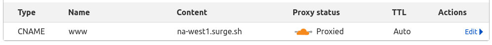

# locker-example-notebook

Simple example notebook application to show how easy to write secure multi-user web application with locker.

## Quickstart (Stage 1): Development/testing on localhost

This is short guide to create and deploy your first locker application on localhost and then deploy it on free CDN. 

### Clone this repository
`git clone https://github.com/yaroslaff/locker-example-notebook.git` and `cd locker-example-notebook`.

### Create app on locker server 
Create application in [myapps](https://myapps.www-security.com):

### Create .env file
~~~shell
LOCKER_HOST=notebook-u1.rudev.www-security.net   # Your host here
LOCKER_KEY=VXhqog....                            # Your key here
~~~

Now, all further `locker-admin` commands require either LOCKER_KEY and LOCKER_HOST env variables, or must be run in directory with this `.env` file.

### Test if app is created and deploy
In same directory with .env file, run `locker-admin ls` or `locker-admin info` to test `LOCKER_HOST` and `LOCKER_KEY` are set properly. 

~~~
$ locker-admin info
Locker host:notebook-u1.rudev.www-security.net key:VXhq...
Origins: ['http://localhost:8000']
Servernames: []
~~~

deploy app:
~~~
locker-admin deploy
~~~
This command will upload application-specific files to your app locker.

Now, if you will do `locker-admin info` again, you will see origins has `https://notebook.ll.www-security.net:8000`.

### Start development webserver
Create self-signed https certificate and key for development:
~~~
openssl req -subj '/CN=localhost'  -new -newkey rsa:2048 -sha256 -days 365 -nodes -x509 -keyout localhost.key -out localhost.crt
~~~

Run server:
~~~
locker-admin serve
~~~

### Visit your application!
Open in browser
https://notebook.ll.www-security.net:8000/

(anything in .ll.www-security.net points to localhost)

You will see warning about your bad self-signed certificate, ignore it and proceed to website.

You see button "Login via Google". Click it and you will see your simple notebook... You may edit and save.  

Congratulations, you deployed first locker application!

## Quickstart (Stage 2): Go production! Custom domain, HTTPS and CDN

We will do this in "hard way", stepping to typical problems and resolving it, but you may scroll down to **Quick way** below. It takes just couple of minutes.

### Domain
You need your own custom domain for this stage. If you do not have one, get free .tk/.ml/.ga/.cf/.gq domain at [freenom.com](https://freenom.com/) . (It does not like VPNs, you may get "Some of your domains could not be registered because of a technical error. These domains have been cancelled: ..." error message. Login from other IP then). I registered `locknote.tk` domain for this guide. Everywhere below use your domain name instead of `locknote.tk`.

#### Delegate to Cloudflare
Use 'Add a Site' on cloudflare, and change NSes (on freenom) to cloudflare DNS servers.

### Host it at surge.sh
Install surge: `npm install --global surge`

Edit file `CNAME` in locker-example-notebook directory and put there name of your site.

Then just run: `surge` in locker-example-notebook directory.

~~~
xenon@braconnier:~/repo/locker-example-notebook$ surge

   Running as yaroslaff@gmail.com (Student)

        project: /home/xenon/repo/locker-example-notebook/
         domain: www.locknote.tk
         upload: [====================] 100% eta: 0.0s (14 files, 93946 bytes)
            CDN: [====================] 100%
             IP: 138.197.235.123

   Success! - Published to www.locknote.tk
~~~

Now we set up CNAME record for host 'www' of your domain in cloudflare to na-west1.surge.sh and make sure proxy enabled (this is needed for HTTPS certificate):

This repo has simple `x.txt` file for tests. Open https://www.locknote.tk/x.txt and if you see "x" - great! Half of job is done.

If you will visit your site (https://www.locknote.tk/) and... it will not work. But we will fix it (And learn how to troubleshoot future problems).

#### Set correct locker_addr in _config.js

First problem, you must use your application locker address in `_config.js`. When you use `locker-admin server` it generates correct content for this file from `$LOCKER_HOST` envirironment file, not even reading file from disk.  We can just steal it from locker-admin, run it again and see https://notebook.ll.www-security.net:8000/_config.js save it as _config.js file. My _config.js is:
~~~
locker_addr = 'https://notebook-u1.rudev.www-security.net'
~~~

After fixing it, upload again (to same domain): `surge`.

#### Origin
Next problem, you may see error message: 
`Forbidden
Cross-Origin request not allowed from this origin "https://www.locknote.tk"`

This happens because https://www.locknote.tk/ is not listed as valid origin in locker. (use `locker-admin info` to confirm this). Add new origin: `locker-admin set-origins + https://www.locknote.tk`. This command modifies `etc/options.json` file for your app. (You can edit it manually: `locker-admin edit etc/options.json`). Run `locker-admin info` again to see your website now listed in Origins.

#### Third-party cookies and locker address from same domain 
At this stage site may work or may not work, depending on browser and settings. Often website works in Firefox, but not in Chrome/Chromium.

Open browser developer console (F12), Network tab, click "Login via Google", then select request to file "authenticated" and see warnings in "Response" tab. You will have something like "WARNING! origin_domain='locknote.tk' not matches target_domain='www-security.net'". 

When locker server (notebook-u1.rudev.www-security.net) tries to set session cookie, this [Third party cookie](https://cookie-script.com/all-you-need-to-know-about-third-party-cookies.html) and it is rejected on site 'locknote.tk'. To avoid this problem, we will use locker server name from same domain.

First, create CNAME on cloudflare, pointing to your locker host (notebook-u1.rudev.www-security.net):

Then set new servername for locker: `locker-admin set-servernames + locker.locknote.tk` (this adds new name to `etc/servernames.json`). Verify with `locker-admin info`:
~~~
Locker host:notebook-u1.rudev.www-security.net key:VXhq...
Origins: ['https://notebook.ll.www-security.net:8000', 'https://www.locknote.tk']
Servernames: ['locker.locknote.tk']
~~~

Put new servername to _config.js:
~~~
locker_addr = 'https://locker.locknote.tk'
~~~
and upload new site again with `surge`.

And now... it works!

#### Quick way (recap)
- Create CNAMEs `wwww` to `na-west1.surge.sh` (with proxy) and `locker` to your app locker host (no proxy)
- `locker-admin set-servernames + locker.locknote.tk`
- `locker-admin set-origins + https://www.locknote.tk`
- Put website hostname in `CNAME` file
- Put your custom locker host to `_config.js`
- Upload site with command: `surge`.

#### Checklist
If something not working, check:
- You have correct host in `locker_addr` in _config.js (same as `$LOCKER_HOST` in `.env` file and in myapps)
- All possible website addresses are listed in Origin
- locker_addr and origin are from same domain.
- `authenticated` returns no warnings.